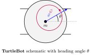
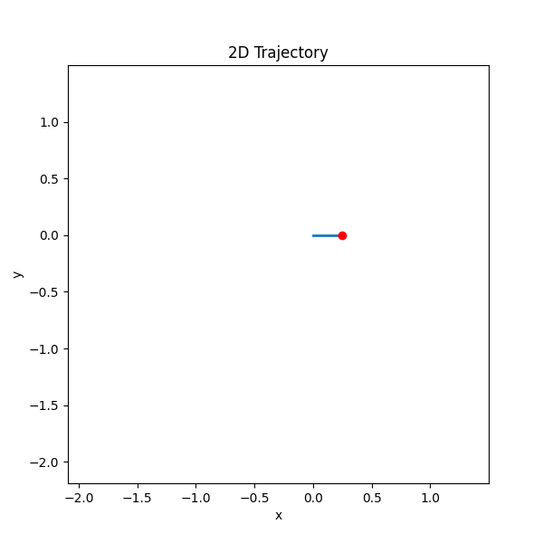
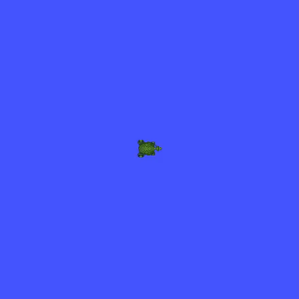
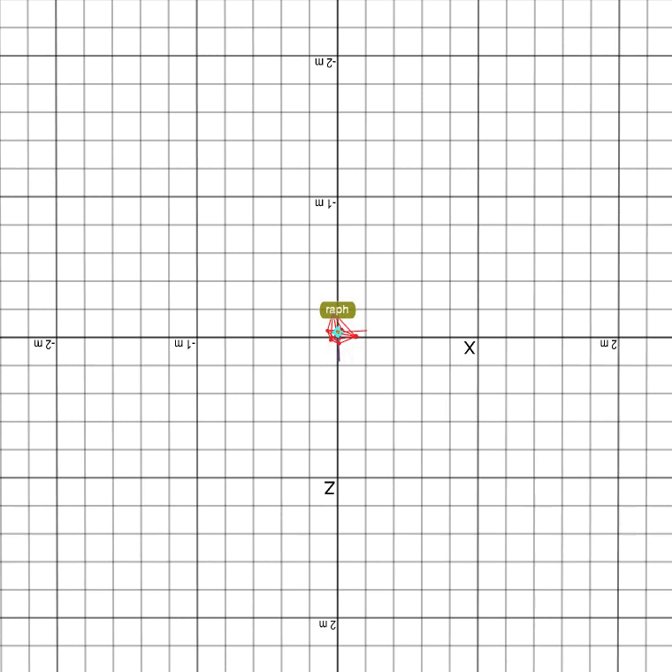

 

# pykal: From Theory to Python to ROS

> _"Cross a river once, swim; cross a river twice, build a boat; cross a river thrice, build a bridge."_ > — old Punjabi saying

pykal is a Python development framework that bridges the chasm between theoretical control systems and their implementation in hardware. Designed for hobbyists, students, and academics alike, this framework won't cure cancer, but it can do the next best thing: make building robots easier.

To get started, or to see what this framework can do, check out the [Quickstart](docs/source/quickstart_index.rst).

For a 3-minute video describing the motivation behind this framework and what it hopes to achieve, click here: [video](video).

---
### Software → Simulation → Hardware → TurtleBot

<table>
  <tr>
    <td align="center">
       
      TurtleBot
    </td>
    <td align="center">
       
      Software
    </td>
    <td align="center">
       
      Simulation
    </td>
    <td align="center">
       
      Hardware
    </td>
  </tr>
</table>

  

---

## Documentation

Full documentation is available at: [https://pykal.readthedocs.io](https://pykal.readthedocs.io)

---

## License

